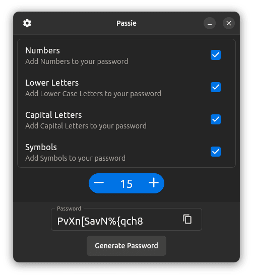
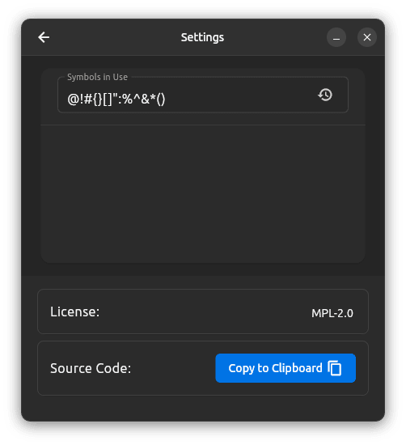

# passie

Passie is a password generator built with flutter, and yaru widgets.

Plans for 4.0:
 - [ ] Use ubuntu_lints for development 
 - [ ] Use ubuntu_localizations for localization support
 - [ ] Make suggestions to the user depending on how strong the password is. It shouldn't be annoying or invasive, added to the fact that the strings generated don't have to be used as passwords in the first place.

This project is licensed under the terms of the MPL-2.0 license