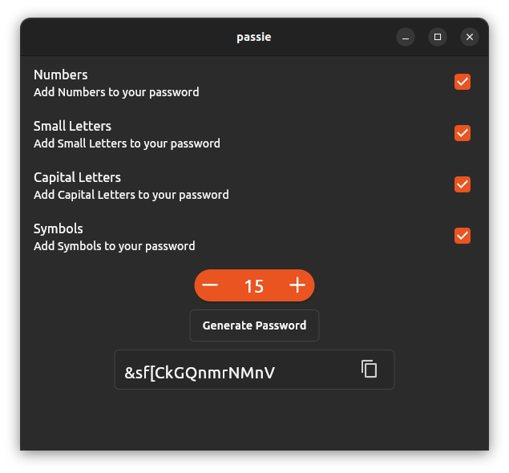
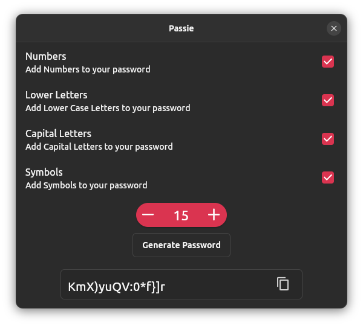
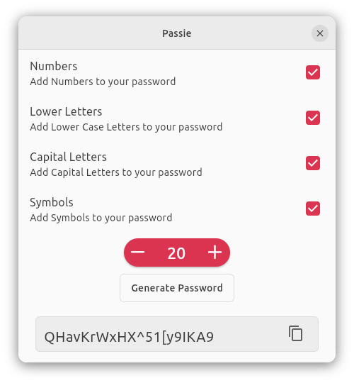

# passie

Passie is a password generator built with flutter, and yaru widgets.

Problems:
- In some cases you get small letters in the generated password even if you de-select it(fixed)

Plans:
- Some Design Improvements(done)
- Ditch gtk-header-bar for the YaruWindowTitleBar (done)
- Get rounded corners(with handy_window)(done)
- Make the app respect the accent colours(it already respects dark/light mode)(done)
- Make an icon (done)
- make a .desktop file(done)
- improve snap(done)
- Publish on Snap Store(working on it)

This project is licensed under the terms of the MPL-2.0 license